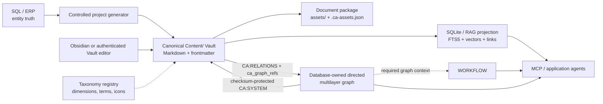

# ⚡ Cyber-Architect Knowledge Platform, Hybrid GraphRAG & MCP Gateway

Cyber-Architect is a local-first knowledge platform built with React, Express and SQLite WAL. Its human-readable documents are Vault-first: Markdown, frontmatter, wikilinks and document-local assets live in Obsidian-compatible `Content/<collection>/<slug>/index.md` packages. SQLite/RAG is a validated, searchable projection; the typed multigraph and Workflow v1 keep their own database-owned operational metadata.

The system deliberately does **not** have one undifferentiated "database of truth". Each concern has a clear owner, and the platform projects those sources into searchable, auditable views.


---

## Architecture at a glance

| Concern | Canonical owner | Platform role |
| --- | --- | --- |
| SQL/ERP entity identity and mandatory structure | Operational SQL/ERP system | Supplies a narrow, validated project snapshot for SQL-driven Markdown generation. |
| Engineering context and free-form knowledge | Obsidian `Content/` Markdown package | Holds the canonical body, frontmatter, wikilinks and document-local placement. |
| Attachments and media | Document package `assets/` + `.ca-assets.json` | Keeps non-text files and their safe metadata beside the document. |
| Taxonomy definitions | SQLite taxonomy registry | Manages dimensions, terms, aliases, icons, colours, filtering, grouping and smart collections. |
| Document taxonomy assignment | Markdown frontmatter | Keeps each document's flat `tax_*` assignments readable in Obsidian. |
| Typed graph definitions and arcs | SQLite graph registry | Stores nodes, edge types, directions, memberships, provenance and audit history. |
| Workflow definition, runtime state and events | SQLite Workflow v1 registry | Stores versioned state machines, guarded transitions, instances and append-only audit events. |
| Search and retrieval | SQLite/RAG index | Refreshes FTS5, vector, document, taxonomy and graph retrieval views from the validated Vault. |

This keeps ownership unambiguous: Markdown is the authoring source, while database-owned graph/workflow metadata never masquerades as free-form document content.



## Key capabilities

- **SQL-driven Markdown generation:** An operational event can create a project `index.md` from the allowlisted `project_snapshot` contract. The generator is deterministic, create-only and never overwrites an existing engineering document.
- **Vault-first Markdown editing:** An authenticated administrator can edit an existing package's complete raw Markdown from its reader view, with SHA-256 revision-conflict protection. Create, rename and move packages in Obsidian, then synchronize.
- **Document-local attachments:** Binary and external resources stay in the package's `assets/` directory and `.ca-assets.json` sidecar, rather than becoming opaque competing database content.
- **Admin-configurable taxonomy:** The three initial core dimensions—industry, technology and audience/role—are registry-driven rather than hard-coded. Administrators can add terms, aliases, icons, colours, relations, filter/grouping settings and declarative smart collections.
- **Multi-graph registry:** A directed, labelled, weighted multilayer multigraph models project → epic → task structures, dependencies, blockers, impacts and custom graph views without duplicating nodes. A node or an edge may be a member of multiple graph layers.
- **Readable Markdown graph projection:** `CA:RELATIONS` is an author-owned typed wikilink block that imports valid relations into the database. `CA:SYSTEM` is a checksum-protected, database-owned readable projection; the system updates only that block and preserves the surrounding Markdown.
- **Native Workflow v1:** A workflow is a separate, versioned labelled transition system attached to one graph context. Only its immutable version's directed transitions can change an instance; each checks the actor type, closed guard AST, evidence rule and finite loop budget before appending an audit event.
- **Bounded graph queries for agents:** Graph traversal accepts a strict query AST with known start nodes, direction, type/origin filters, maximum depth, maximum nodes, confidence and time constraints. It never accepts raw SQL, JavaScript or unbounded recursion.
- **Local GraphRAG:** Hybrid retrieval combines heading-aware Markdown chunks, FTS5/BM25 and dense vector similarity. SQL fact profiles are explicitly allowlisted and remain separate from content authoring.
- **Safe MCP boundary:** Public MCP tools provide read/search and communication capabilities. Content mutation remains disabled in MCP; authors use the Vault or authenticated Vault editor instead.

## Quick start

### Prerequisites

- **Node.js:** `>= 22.12.0`
- **npm** or **pnpm**

### Installation

```powershell
git clone https://github.com/your-username/cyber-architect.git
cd cyber-architect/CyberArchitectReact
npm install
Copy-Item .env.example .env
```

### Run locally

```powershell
# API server: port 3001
npm run server

# In a second terminal: Vite frontend, normally port 5173
npm run dev
```

Open `http://localhost:5173`.

### Use a portable content workspace

Keep the Vault and its SQLite/RAG projection together in a persistent
workspace. Configure the Vault root and its hidden data directory in `.env`:

```dotenv
CYBER_ARCHITECT_CONTENT_ROOT=C:/Knowledge/CyberArchitect-Vault
CYBER_ARCHITECT_WORKSPACE_DATA_DIR=C:/Knowledge/CyberArchitect-Vault/.cyberarchitect
```

This produces `portfolio.sqlite` and its backups inside the workspace data
directory. Each document keeps its own binary files beside `index.md`, not in
the live database directory. Blog and Knowledge are the same document model;
`presentation_profile` selects only the reader-facing view. One database can contain many logical projects,
selectable from the Knowledge Hub's **Project / workspace** filter and
shareable as `project_id` in the URL. Do not synchronize live SQLite WAL files
with Obsidian Sync, OneDrive, Dropbox or Git. See the
[workspace storage guide](docs/WORKSPACE_STORAGE.md) for the path precedence,
backup and safe-relocation procedure.

### Synchronize the canonical Vault

```powershell
# Preview: validates every Content/ document without writing SQLite/RAG.
npm run sync:knowledge:check

# Apply: refreshes the SQLite/RAG and Markdown-driven graph projections.
npm run sync:knowledge
```

The sync is fail-closed on duplicate slugs or document IDs, invalid
frontmatter, unknown taxonomy terms, malformed graph blocks or a remaining
`KnowledgeBase/` or `Blog/` root. For a separately received historical
vault, preview and explicitly apply the package migration instead:

```powershell
npm run vault:migrate-content-packages
npm run vault:migrate-content-packages:apply
```

### Contextual Markdown editing for administrators

An authenticated `OVERSEER_ADMIN` can open an existing document and use
**SZERKESZTÉS** directly from the reader. The editor loads the complete raw
`index.md`, including frontmatter, and writes it back to the same Vault
package. Each update carries a SHA-256 revision; if Obsidian or another browser
saved first, the server returns `409` and preserves the local draft.

Create a new package, move it, rename it, or add package-local files in
Obsidian using `ObsidianTemplates/`; then run the Vault synchronization. The
direct DB folder/document/asset writer routes are intentionally retired so they
cannot create a second content source.

### Generate an SQL-backed project index

The operational fact gateway must be configured before generation. Use a dry run first:

```powershell
node server/scripts/generateSqlMarkdown.js PRJ-2026-884 --dry-run
node server/scripts/generateSqlMarkdown.js PRJ-2026-884
```

The default target is `Content/02_SQL_Projects/project-prj-2026-884/index.md`. If that file already exists, the generator returns `skipped_existing`; it does not replace the author’s work.

The generator ensures a matching Knowledge Project and database-owned
`project/<project_id>` graph. Vault sync maintains a system-owned
`project → contains → document` projection while preserving independent
epic/task and impact arcs.

## Vault templates and attachments

The reusable templates live in the active Vault's [`ObsidianTemplates/`](../CyberArchitect/ObsidianTemplates/README.md) directory and are managed from the Admin **Vault Templates** tab. The SQL project template uses the catalog body for future generated files while the generator retains exclusive ownership of the frontmatter.

Keep binary and external resources with their document:

```text
document-slug/
  index.md
  .ca-assets.json
  assets/cad/layout.dwg
```

Use the sidecar for DWG/PDF/image/audio/video records and external GitHub, YouTube or HTTPS references. Local paths cannot leave the document folder; the application presents icons, availability and safe links without adding nested objects to Obsidian Properties.

## Graph relation authoring and traversal

A Vault document can participate in several graphs through its flat
`ca_graph_refs` frontmatter list. Graph definitions, edge types, M:N
memberships and audit remain SQLite-owned; author-owned typed relations belong
only inside the following Markdown block:

```markdown
<!-- CA:RELATIONS:BEGIN v1 -->
## Custom typed relations
- depends_on → [[TASK-004]] · graph: project/prj-2026-884
- blocks ← [[TASK-018]] · graph: project/prj-2026-884
- related_to ↔ [[EPIC-002]] · graphs: project/prj-2026-884, impact/production
<!-- CA:RELATIONS:END -->
```

`→` records an outbound arc, `←` an inbound arc, and `↔` requests paired directed arcs. The referenced graph and edge type must be registered; ordinary `[[wikilink]]` syntax remains a normal documentation link, not a typed graph assertion.

Public, explicitly public graph layers can be traversed through the bounded endpoint:

```text
POST /api/knowledge/graphs/:graphId/traverse
```

```json
{
  "start_node_ids": ["task:TASK-012"],
  "edge_type_ids": ["depends_on", "blocks"],
  "direction": "inbound",
  "max_depth": 3,
  "max_nodes": 100,
  "min_confidence": 0.7
}
```

The authenticated `/api/admin/graphs/:graphId/traverse` route provides the same validated traversal over private layers. See the [agent architecture guide](docs/AGENT_ARCHITECTURE.md) for the agent safety contract.

## Workflow v1: emberi és agent folyamatok

Az admin **WORKFLOW_STUDIO** külön kezeli a futtatható folyamatot és a
tudásgráfot. Egy workflow-definíció pontosan egy `graph_id`-hez kapcsolódik,
de a gráf `contains`, `depends_on`, `related_to`, `CA:RELATIONS` vagy `↔`
kapcsolata nem válik automatikusan végrehajtható transitionné.

A kiadott verzió véges állapotgépe:

```text
W = (S, T, s0, F, Γ, R)
```

ahol `S` a lépések (`start`, `task`, `decision`, `wait`, `end`), `T` az
irányított transitionök, `Γ` a zárt guard AST, `R` pedig az engedélyezett
`human` / `agent` / `service` aktortípusok, az evidence-követelmény és a
korlátok. A kétirányú üzleti folyamat két külön transition: a visszaút saját
guardot, evidence-szabályt és `max_iterations` értéket kap. A teljes példányt
a verzió `max_total_steps` korlátja védi.

Az instance aktuális lépése és az append-only `workflow_instance_events` audit
az SQLite-ban él. A Markdown csak a lapos `ca_workflow_definition_ref` és
`ca_workflow_graph_ref` hivatkozást, a magyarázatot és a kapcsolódó tudást
tartalmazhatja; használja a Vault [workflow-sablonját](../CyberArchitect/ObsidianTemplates/ca_workflow_definition.md).
V1-ben nincs külső executor, automatikus scheduler vagy agent-eszközhívás.

Az admin API-k: `GET/POST /api/admin/workflows`,
`POST /api/admin/workflows/:workflowId/versions`,
`POST /api/admin/workflows/:workflowId/versions/:version/publish`,
`POST /api/admin/workflows/:workflowId/instances` és
`POST /api/admin/workflow-instances/:instanceId/transitions` (valamint
pause/resume/fail). Egy instance `available_transitions` vetülete mindig a
saját kiadott verziójára és aktuális lépésére szűkül; a szerver a tényleges
átadáskor ismét validál.

## Connecting AI agents via MCP

Add the local MCP server to the client configuration:

```json
{
  "mcpServers": {
    "cyber-architect": {
      "command": "node",
      "args": ["server/mcp/server.js"]
    }
  }
}
```

Public MCP use is read-oriented: for example `search_knowledge`, `get_knowledge_article`, `list_projects`, `get_architecture_blueprint` and `get_system_health`. Authentication can authorize explicitly supported operational actions, but it does not re-enable direct CMS/SQLite content mutation. An MCP graph adapter, if added later, must call the same bounded graph-query schema as the HTTP API.

## Quality checks

```powershell
npm run lint
npm test
npm run build
```

## Architecture documentation

- [Current implementation state and ownership reconciliation](STATE.md)
- [System architecture](docs/SYSTEM_ARCHITECTURE.md)
- [Hybrid Obsidian–SQL GraphRAG](docs/HYBRID_OBSIDIAN_SQL_RAG.md)
- [SQL-driven Markdown generation](docs/SQL_DRIVEN_MARKDOWN_GENERATION.md)
- [Portable Vault workspace and SQLite storage](docs/WORKSPACE_STORAGE.md)
- [Autonomous agent architecture](docs/AGENT_ARCHITECTURE.md)
- [ADR-0001: SQL-driven Markdown generation](../docs/adr/adr-0001-sql-driven-markdown-generation.md)
- [ADR-0002: Configurable taxonomy and Obsidian frontmatter](../docs/adr/adr-0002-configurable-taxonomy-and-obsidian-frontmatter.md)
- [ADR-0003: Database-first directed multilayer graph](../docs/adr/adr-0003-database-first-directed-multilayer-graph.md)
- [ADR-0004: Unified content model and presentation profiles](../docs/adr/adr-0004-unified-content-model-and-presentation-profiles.md)
- [ADR-0005: Native DB-first Workflow v1](../docs/adr/adr-0005-native-db-first-workflow-v1.md)

## License

Distributed under the MIT License. See `LICENSE` for details.
