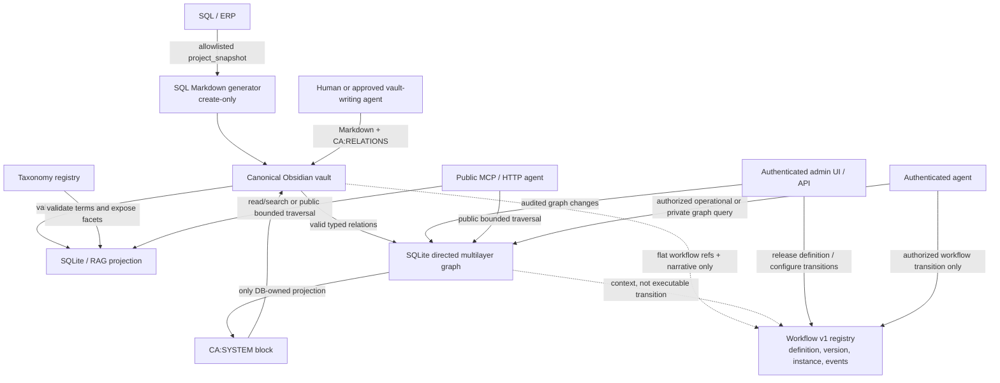

# 🤖 Autonomous Agents, MCP and Safe Graph Queries

This reference defines what an AI agent may read, write, query and infer in the Cyber-Architect platform. It is intentionally stricter than a general-purpose database API: agents must be useful without becoming an uncontrolled author, SQL client or graph traversal engine.

## 1. Ownership model

An agent must respect the owner of each kind of information. No agent permission turns one layer into the source of truth for another.

| Information | Canonical owner | Agent rule |
| --- | --- | --- |
| SQL project identity, name, creation time and mandatory structural facts | Operational SQL/ERP through the allowlisted gateway | Do not create or guess these fields. The SQL Markdown generator obtains them from `project_snapshot`. |
| Markdown body, engineering rationale and ordinary wikilinks | Canonical server-side Obsidian vault | Author only through an approved vault-writing workflow; run or request Vault → SQLite/RAG synchronization afterwards. |
| `presentation_profile` and `document_role` | Canonical Markdown frontmatter | `presentation_profile` controls the reader view only (`knowledge` or `article`); it is not a separate document type. `content_type` is legacy compatibility input. |
| Taxonomy dimensions, terms, aliases, icons, colours, relations and smart-collection rules | SQLite taxonomy registry | Query registered IDs; do not invent taxonomy terms or write nested taxonomy objects. |
| `tax_*` document assignments | Markdown frontmatter | Use registered ASCII term slugs in flat top-level lists, for example `tax_technology: [obsidian, graph-rag]`. |
| Graph definitions, nodes, edge types, arcs, memberships, provenance and audit | SQLite graph registry | Use validated graph APIs. A graph membership is a reference, never a copy of a node or an edge. |
| Workflow definitions, released versions, steps, transitions, guards and allowed actor types | SQLite Workflow v1 registry | Read or change only through its dedicated, version-aware workflow contract. A graph edge or `CA:RELATIONS` line is not an executable transition. |
| Workflow instance status, current step, context, step count and event history | SQLite Workflow v1 runtime | Submit only an authorized transition from the current step. Do not reconstruct runtime state from Markdown or alter event history. |
| RAG chunks, FTS/vector indexes and link projections | SQLite/RAG projection | Treat as a searchable projection, not an authoring destination. |

## 2. System topology



The arrows are ownership-aware. For example, the graph may project an existing database-owned relation into Markdown, but Markdown does not become the authority for that projected relation.

## 3. MCP boundary

### Public agent capabilities

Unauthenticated MCP use is read-oriented. Typical tools include:

- `search_knowledge` for public hybrid knowledge search;
- `get_knowledge_article` for a public Markdown article and its metadata;
- `list_projects` and `list_knowledge_projects` for public catalogues;
- `get_architecture_blueprint` and `get_system_health` for operationally safe diagnostics;
- `create_message_uplink` for a routed inquiry.

The public side must not access private graph layers, raw operational facts, audit records, vault paths or authoring operations.

### Authenticated agent capabilities

Authentication authorizes only explicitly exposed operational actions and is not a blanket data-write grant. In particular, the legacy MCP tools `publish_knowledge_article`, `update_knowledge_article`, `delete_knowledge_article` and their blog equivalents are intentionally disabled for content mutation. They return `LOCAL_VAULT_AUTHORITATIVE` even after successful credential validation.

To change knowledge content, an approved workflow edits the canonical server-side Obsidian vault and synchronizes it. To create an SQL-bound document shell, it invokes the dedicated create-only SQL Markdown generator; it does not submit free-form YAML or raw SQL to MCP.

The typed graph traversal API is currently an HTTP API rather than an MCP tool. Any future MCP adapter must use the exact same validated query schema and visibility checks; it must not gain a generic SQL, filesystem or arbitrary-graph-query escape hatch.

### Workflow v1 boundary

Workflow v1 has no public MCP execution capability. Its authenticated workflow
operations use the dedicated, version-aware runtime contract. An agent must not
infer a workflow command from a graph traversal, a wikilink, `CA:RELATIONS`, a
document heading or a frontmatter value.

The runtime contract is deliberately narrower than a generic agent loop:

1. An operation names one concrete `workflow_instance`, its current released
   `workflow_version` and an allowed `transition_id`.
2. The caller supplies a typed actor (`human`, `agent` or `service`), optional
   evidence and a constrained runtime-context patch; it does not supply SQL,
   a program, a next-state override or an event record.
3. The runtime verifies that the transition starts at the instance's current
   step, permits the submitted actor type, satisfies the guard AST and has
   evidence when `evidence_required` is true.
4. It also enforces the version `max_total_steps` and the transition's optional
   `max_iterations`, then records an append-only
   `workflow_instance_events` event.

An agent transition therefore does not grant unrestricted autonomy. A
transition restricted to `human` cannot be completed by an agent, and an agent
cannot alter the definition, published version or event history. External
executors such as Camunda, Temporal, AWS Step Functions and LangGraph, as well
as an automatic scheduler, are outside Workflow v1; any later adapter needs a
separate explicit command/event contract.

## 4. Obsidian authoring contract

### Flat frontmatter only

Obsidian Properties safely supports top-level scalars and lists. Do not write nested objects such as the retired `dimensions` map or a graph object into frontmatter.

```yaml
presentation_profile: knowledge
document_role: engineering-note
taxonomy_schema: 2
tax_industry: [gyartas]
tax_technology: [obsidian, graph-rag]
tax_audience_role: [folyamatmernok]
ca_graph_refs: [project/prj-2026-884]
ca_workflow_definition_ref: workflow/change-approval
ca_workflow_graph_ref: workflow/change-approval
ca_sync_version: 1
```

`tax_*` values are registered term slugs. `ca_graph_refs` is only a flat reference to graph views; it never contains edge metadata. `ca_workflow_definition_ref` and `ca_workflow_graph_ref` are similarly flat references from a workflow-design document to DB-owned definitions and graph context. `ca_*` fields are Cyber-Architect system properties and must remain a scalar or simple list value.

Do not add `workflow`, `steps`, `transitions`, `guard`, `instance`, `events`,
`current_step`, `context`, `step_count` or actor data as a nested or pseudo-JSON
frontmatter property. The live workflow state is database-owned. Markdown can
explain a workflow and link its evidence, but it cannot become the runtime
source of truth.

### Three Markdown ownership zones

| Zone | Owner | Agent behaviour |
| --- | --- | --- |
| Normal Markdown body and ordinary `[[wikilink]]` links | Human / approved authoring agent | May edit within the document’s approved scope. |
| `CA:RELATIONS` | Human / approved authoring agent | May add valid typed knowledge/graph relation lines. The vault sync validates and imports them as `markdown_projection` graph arcs, never as workflow transitions. |
| `CA:SYSTEM` | Cyber-Architect graph projection writer | Never edit manually. It is checksum-protected and may be regenerated only from committed database state. |

Use typed relation lines only inside the author-owned block:

```markdown
<!-- CA:RELATIONS:BEGIN v1 -->
## Custom typed relations
- depends_on → [[TASK-004]] · graph: project/prj-2026-884
- blocks ← [[TASK-018]] · graph: project/prj-2026-884
- related_to ↔ [[EPIC-002]] · graphs: project/prj-2026-884, impact/production
<!-- CA:RELATIONS:END -->
```

The direction symbol is data, not decoration:

- `→` creates an outbound asserted arc from the current document.
- `←` creates an inbound asserted arc to the current document.
- `↔` requests two paired directed arcs under one relation group.

The graph and edge type must exist and be valid for the node types. A malformed, unknown or ambiguous relation fails closed during synchronization. An ordinary wikilink outside `CA:RELATIONS` is still a normal document link and is not promoted into a typed assertion by this contract.

For a workflow-design document, the same block can link a project, a task, a
policy, an evidence document or a workflow graph layer. It remains an
authoring/knowledge assertion. It does **not** define a workflow step, an
execution order, a guard, a runtime state or a state transition. In
particular, `↔` means two paired directed graph arcs with shared relationship
identity; it does not authorize a process to execute in both directions.

## 5. Database-first directed multilayer graph

The graph model is a directed, labelled, weighted multigraph. An arc carries source, target, edge type, origin, provenance, `weight`, `confidence`, `cost`, validity interval, visibility and active state. Parallel arcs are allowed when their meaning differs.

Every stored relationship is an oriented arc. A two-way relation is stored as a paired arc set, not as an undirected special case. This preserves distinct evidence and confidence in each direction.

Graph layers are views over shared identity:

- A global `graph_node` can represent `project:PRJ-2026-884`, `epic:EPIC-001`, `task:TASK-012`, a Markdown document or a taxonomy term.
- `graph_node_memberships` and `graph_edge_memberships` connect the same node or edge to any number of graph definitions.
- Adding a project task to an impact graph creates a membership, not a duplicate task record.

This permits a project structure graph, dependency graph and impact graph to overlap while remaining queryable as distinct layers.

## 5.1 Workflow model: linked to the graph, separate from it

Workflow v1 treats a released workflow as a versioned labelled transition
system, not as a generic graph layer. Its own DB entities are
`workflow_definitions`, immutable `workflow_versions`, `workflow_steps`,
`workflow_transitions`, `workflow_instances` and append-only
`workflow_instance_events`. Every workflow definition has one required
`graph_id` for context, but a transition is executable only when it belongs to
the instance's released version.

The distinction matters in both directions:

- A `depends_on`, `contains`, `supports` or `related_to` graph edge may help an
  agent explain impact or collect evidence, but cannot move workflow state.
- A workflow transition may reference graph context, but it is not implicitly a
  reusable truth claim in every graph layer.
- A reciprocal graph relation is a pair of arcs. A workflow loop is a specific
  directed return transition with a guard and the V1 step limits.

The runtime validates a small guard AST rather than evaluating agent prose or
arbitrary code. Supported values are allowlisted runtime-context paths,
type-correct comparisons and `all` / `any` / `not` composition. SQL, shell,
JavaScript, HTTP requests, regular expressions and direct LLM text are not
guards. The version-level `max_total_steps` caps every execution; every
transition that belongs to a directed cycle must set a positive
`max_iterations`. Retry, timeout, backoff and escalation are not V1 runtime
policy.

The event log records the actor (`human`, `agent` or `service`), previous and
next step, transition, evidence refs, runtime-context patch and timestamp. It
is append-only: a correction adds a new event and does not rewrite the past.

## 6. Safe graph traversal contract

### Endpoints

| Scope | Endpoint | Visibility |
| --- | --- | --- |
| Public layer | `POST /api/knowledge/graphs/:graphId/traverse` | Active, explicitly public graph, nodes, edge types and arcs only. |
| Admin layer | `POST /api/admin/graphs/:graphId/traverse` | Authenticated query over the requested private or public graph layer. |

The request body is a strict, declarative AST:

```json
{
  "start_node_ids": ["task:TASK-012"],
  "edge_type_ids": ["depends_on", "blocks"],
  "node_types": ["task", "epic"],
  "origins": ["admin", "markdown_projection"],
  "direction": "inbound",
  "max_depth": 3,
  "max_nodes": 100,
  "min_confidence": 0.7,
  "as_of": "2026-08-21T12:00:00.000Z"
}
```

The schema limits `max_depth` to 6 and `max_nodes` to 250. It contains no SQL, regular expression, JavaScript predicate or arbitrary recursive program. The traversal performs bounded breadth-first expansion over the selected graph membership and returns `nodes`, `edges`, concrete `paths` and a `truncated` flag.

When answering from a graph, an agent should:

1. Name the graph layer and starting node it used.
2. Preserve the edge type and traversal direction; `depends_on` and `blocks` are not interchangeable.
3. Cite the returned path rather than claiming a relationship that was not traversed.
4. Respect `confidence`, validity time and visibility.
5. State that the result is partial when `truncated` is `true`.

An administrative result retains graph membership, origin and provenance fields for audit. The public endpoint intentionally limits its response to public-safe graph and path data.

## 7. Safe graph and Markdown mutation

Graph changes made through the authenticated admin API are validated, committed to the database and audit-logged before their Markdown projection is attempted. The canonical graph mutation is not rolled back merely because a Markdown projection cannot be written. An administrator can explicitly retry affected `CA:SYSTEM` projections.

The projection writer uses a temporary file, backup and rename workflow, and changes only an explicit `CA:SYSTEM` block. If its checksum shows manual drift, it fails closed rather than silently overwriting user text. It never writes the `CA:RELATIONS` block.

For agent-driven authoring, prefer the smallest correct action:

1. Add a valid relation to `CA:RELATIONS` only when the authoring task grants vault-write access.
2. Run the vault synchronization so it is parsed, validated and imported.
3. Use the admin graph API for graph definitions, edge types, non-Markdown nodes or database-owned relations.
4. Do not infer a workflow transition from a relation, or put workflow state, guard or events into Markdown.
5. Do not patch `CA:SYSTEM`, invent IDs, serialize graph metadata into YAML or mirror data manually between graph layers.

## 8. Security controls

1. **Authentication and visibility:** Public paths can see only explicit public content and graph layers. Private graph operations require the admin authentication middleware.
2. **Typed validation:** Zod schemas restrict IDs, metadata size, edge origin, visibility, node/edge type assignments and traversal inputs.
3. **Bounded work:** Query depth and node limits protect the system from uncontrolled graph expansion.
4. **No raw query channel:** SQL fact access is profile-allowlisted; taxonomy smart collections and graph traversal use declarative schemas, not user-supplied SQL or JavaScript.
5. **Ownership-aware projection:** The SQL generator is create-only; the graph writer changes only `CA:SYSTEM`; the RAG store is not an authoring target.
6. **Auditability:** Graph definitions, nodes, edges and membership changes are recorded with actor and state information. Graph answers can retain their traversed paths and evidence metadata.
7. **Workflow execution boundary:** Workflow v1 requires a released version, current source step, `allowed_actor_types` check, bounded guard AST, required evidence and append-only event before a state change. Graph arcs and Markdown relations cannot bypass this boundary.
8. **Loop containment:** The runtime enforces version-level `max_total_steps` and requires positive `max_iterations` on every transition in a directed cycle. An agent may not create an unbounded self-directed loop; timeout/retry/escalation automation is outside V1.

## 9. Local MCP configuration

```json
{
  "mcpServers": {
    "cyber-architect": {
      "command": "node",
      "args": ["server/mcp/server.js"]
    }
  }
}
```

For the full system boundary, see [Hybrid Obsidian–SQL GraphRAG](HYBRID_OBSIDIAN_SQL_RAG.md), [SQL-driven Markdown generation](SQL_DRIVEN_MARKDOWN_GENERATION.md), [ADR-0003](../../docs/adr/adr-0003-database-first-directed-multilayer-graph.md) and [ADR-0005](../../docs/adr/adr-0005-native-db-first-workflow-v1.md).
