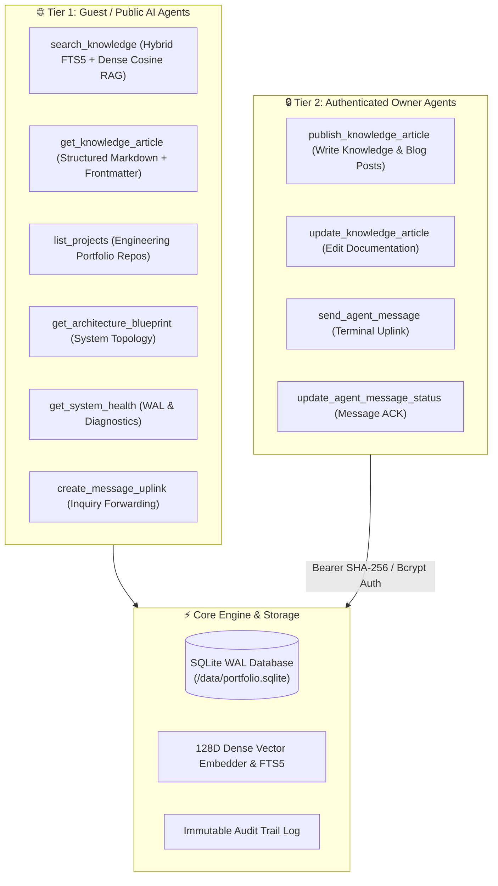

# 🤖 Autonomous Agent Architecture & Model Context Protocol (MCP) Guide

This guide details the multi-agent coordination architecture, Model Context Protocol (MCP) server endpoints, and terminal integration principles of the Cyber-Architect platform.

---

## 🏗️ Architecture Overview

The platform is designed around a **Dual-Tier Model Context Protocol (MCP)** gateway that enables AI agents (Claude Desktop, Cursor, Windsurf, Claude Code, autonomous background workers) to interact with the platform safely.



---

## 🔌 Model Context Protocol (MCP) Setup

### 1. Claude Desktop Configuration
Add the server to your `claude_desktop_config.json`:

```json
{
  "mcpServers": {
    "cyber-architect": {
      "command": "node",
      "args": ["server/mcp/server.js"]
    }
  }
}
```

### 2. Cursor IDE
Create or update `.cursor/mcp.json`:

```json
{
  "mcpServers": {
    "cyber-architect": {
      "command": "node",
      "args": ["server/mcp/server.js"]
    }
  }
}
```

### 3. Remote SSE Gateway (Production Deployment)
When connecting over the internet to a deployed instance at `https://www.ai.szantoi.hu`:

```json
{
  "mcpServers": {
    "cyber-architect-remote": {
      "command": "npx",
      "args": ["-y", "mcp-remote", "https://www.ai.szantoi.hu/api/sse"]
    }
  }
}
```

---

## 🛡️ Security & Zero-Trust Guidelines
1. **Public Read-Only Default:** All unauthenticated calls to mutating tools (`publish_*`, `send_agent_message`) are immediately rejected with HTTP/JSON-RPC 401 and recorded in the audit trail.
2. **Timing-Safe Key Comparison:** Token verification uses constant-time cryptographic checks (`crypto.timingSafeEqual`) to prevent timing attack side-channels.
3. **Sliding-Window Rate Limiter:** Protects MCP endpoints against DoS and query spamming (60 calls/minute/tool threshold).
4. **Parameterized Prepared Statements:** All database queries utilize Better-Sqlite3 prepared statements with zero raw SQL concatenation.
