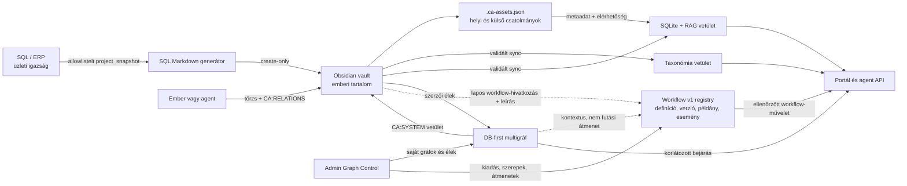

# Cyber-Architect rendszerarchitektúra

> Kanonikus műszaki áttekintés fejlesztőknek, adminisztrátoroknak és agenteknek. A részletes, változtatást indokló döntések az [ADR-ekben](../../docs/adr/) találhatók.

## 1. Cél és alapmodell

A Cyber-Architect nem egyetlen adattár köré épül. Az információ annak természetes forrásában marad, és a rendszer ellenőrzött vetületeket épít belőle:

| Réteg | Kanonikus felelősség | Nem ez a felelőssége |
| --- | --- | --- |
| SQL / ERP | üzleti entitás, stabil azonosító, kötelező strukturális adat | emberi szakmai magyarázat és szabad jegyzet |
| Obsidian Markdown vault | szakmai törzs, bizonyíték, szerzői wikilink és szerzői kapcsolat | gazdag gráfobjektum vagy admin-konfiguráció |
| Dokumentummappa + `.ca-assets.json` | egy jegyzethez kötött binárisok, külső források és függőségek | nested frontmatter vagy bináris RAG-szöveg |
| Taxonómia-registry (SQLite) | dimenziók, termek, aliasok, ikonok, színek, filter- és csoportosítási szabályok | dokumentum szabad szövege |
| Gráf-registry (SQLite) | saját gráfok, csúcsok, éltípusok, irány, súly, bizonyosság, tagság és audit | Markdown-törzs felülírása |
| Workflow-registry (SQLite, Workflow v1) | verziózott folyamatdefiníció, lépések, átmenetek, guardok, szerepek, futó példányok és eseményaudit | tetszőleges tudásgráf-él végrehajtása vagy nested Markdown-állapot |
| SQLite / RAG | keresési, indexelési és lekérdezési vetület | szerzői vagy üzleti igazságforrás |

Ez a megosztás egyszerre szünteti meg a kézi YAML-azonosítóhibát és őrzi meg az Obsidian emberközeli szerkesztési modelljét.

### Egységes dokumentumcsomag

Minden Markdown ugyanazt a dokumentumsémát, taxonómia-, csatolmány- és
gráfszerződést használja. A `presentation_profile: knowledge | article` kizárólag
az olvasói/webes nézetet választja ki; nem másik fájltípust, tárolót vagy
kapcsolati modellt jelent. Az új anyagok semleges `Content/<terület>/<slug>/index.md`
csomagba kerülnek. A történeti `KnowledgeBase/` és `Blog/` fák nem
szinkronforrások: egyszeri, backupos csomagmigráció után megszűnnek. A régi
`content_type: knowledge | blog` csak kompatibilitási vetület; az indexben és
az új sablonokban a profil az elsődleges.



## 2. Első olvasási útvonal

| Ha ezt szeretnéd megérteni vagy elvégezni | Kiinduló dokumentum |
| --- | --- |
| Teljes rendszerkép és ownership | Ez a dokumentum |
| SQL-projektből dokumentum létrehozása | [SQL-vezérelt Markdown generálás](SQL_DRIVEN_MARKDOWN_GENERATION.md) |
| Vault, RAG, taxonómia és belső SQL-kontekstus | [Hibrid Obsidian–SQL GraphRAG](HYBRID_OBSIDIAN_SQL_RAG.md) |
| Agent- és MCP-jogok, biztonságos lekérdezések | [Agent architektúra](AGENT_ARCHITECTURE.md) |
| Workflow-definíció, kontrollált ciklus és ember–agent átmenet | [ADR-0005](../../docs/adr/adr-0005-native-db-first-workflow-v1.md), [Workflow sablon](../../CyberArchitect/ObsidianTemplates/ca_workflow_definition.md) |
| Obsidian-fájl készítése vagy kézi szerkesztése | [Vault agent guide](../../CyberArchitect/AGENT_GUIDE.md) |
| Hordozható Vault + SQLite munkatér beállítása | [Workspace tárolás](WORKSPACE_STORAGE.md) |
| Döntés háttere | [ADR-0001](../../docs/adr/adr-0001-sql-driven-markdown-generation.md), [ADR-0002](../../docs/adr/adr-0002-configurable-taxonomy-and-obsidian-frontmatter.md), [ADR-0003](../../docs/adr/adr-0003-database-first-directed-multilayer-graph.md), [ADR-0004](../../docs/adr/adr-0004-unified-content-model-and-presentation-profiles.md), [ADR-0005](../../docs/adr/adr-0005-native-db-first-workflow-v1.md) |

## 2.1 Hordozható munkatér és több projekt

Egy munkatér a konfigurált Obsidian Vault-ból és az annak gyökerében lévő
`.cyberarchitect/portfolio.sqlite` adatbázisból állhat. Az utóbbi a taxonómia-,
gráf-, audit- és RAG-vetületet, valamint az adatbázis-munkaterületeket tartja;
nem Markdown-tartalom és a crawler nem olvassa. Az opt-in
`CYBER_ARCHITECT_WORKSPACE_DATA_DIR` erre a rejtett könyvtárra mutat. A teljes
beállítási, mentési és szinkronizációs szerződés a
[Workspace tárolás](WORKSPACE_STORAGE.md) dokumentumban van.

Egy SQLite-munkatérben több logikai `knowledge_projects` és egymástól független
`project/<id>` gráf élhet. Ez a több projektet kezelő alapmodell. Egy szerverfolyamat
azonban tudatosan csak egy fizikai SQLite-adatbázist tart nyitva; két teljesen
elkülönített Vault-hoz külön folyamat vagy kontrollált újraindítás kell.

## 3. SQL-vezérelt Markdown létrehozás

Új, SQL-hoz kötött projekt esetén a **Push** út az alapértelmezett:

1. Az ERP-ben létrejön a projekt.
2. Egy hitelesített worker kizárólag a `project_snapshot` allowlistelt szerződését kéri le.
3. A központi sablon create-only módon létrehozza a projekt `index.md` fájlját a vaultban.
4. A generátor a stabil `sql_project_id`, `document_id`, láthatósági mezők és sablonverzió tulajdonosa.
5. A mérnök a létrejött Markdown-törzsbe írja a szakmai kontextust; a generátor ezt később sem írja felül.
6. A Vault → SQLite/RAG sync indexeli a dokumentumot.

A generált dokumentumhoz a rendszer saját `knowledge_projects` munkateret és stabil `project/<project_id>` gráfot is fenntart. A szinkron a DB-ben egy `projekt → contains → dokumentum` élt vetít, de sem az ember/agent `CA:RELATIONS`, sem az admin epic/task/hatáséleit nem módosítja.

A generátor soha nem kap kliensoldali YAML-t, nyers SQL-t, adatbázis-kapcsolatot vagy pilot snapshotot. Létező fájl esetén nem módosít, hanem `skipped_existing` eredményt ad.

## 4. Obsidian-kompatibilis frontmatter

Az Obsidian Properties megbízhatóan legfelső szintű scalar-, list-, dátum-, checkbox- és tagmezőket kezel. Emiatt a rendszer új dokumentumban nem használ nested `dimensions`, `relations`, `generated` vagy `sql_bindings` objektumot.

```yaml
presentation_profile: knowledge
document_role: project-index
taxonomy_schema: 2
tax_industry: [manufacturing]
tax_technology: [obsidian, graph-rag, sql]
tax_audience_role: [process-engineer]
tags: [ca/industry/manufacturing, ca/technology/obsidian]
ca_graph_refs: [project/prj-2026-884]
ca_workflow_definition_ref: workflow/change-approval
ca_workflow_graph_ref: workflow/change-approval
ca_sync_version: 1
```

- A `tax_*` mezők dokumentumhoz rendelt, stabil term-slugok.
- A `presentation_profile` a portálon választ nézetet; a `document_role`
  (például `project-index`, `meeting`, `article`) a dokumentum célját nevezi
  meg, ezért nem keveredik a megjelenítéssel.
- A címke, ikon, szín és alias a DB-registryből származik.
- A `tags` opcionális, Obsidian-navigációs vetület; nem a taxonómia elsődleges szerződése.
- A `ca_*` mezők Cyber-Architect rendszer-owned mezők. Csak lapos értéket vagy listát tartalmazhatnak.
- A `ca_workflow_definition_ref` és `ca_workflow_graph_ref` workflow-design dokumentumnál csak stabil, lapos DB-hivatkozás. Nem tárolhatnak aktuális lépést, futási állapotot, guardot, átmenetet, kiosztást vagy eseményt.
- A korábbi `dimensions` formátum csak kompatibilitási olvasásra szolgál; az Obsidian által felajánlott szöveggé konvertálását nem szabad elfogadni.

## 5. Dokumentummappa és elsőrendű csatolmányok

Minden cikk vagy projektindex önálló mappában élhet. A nem jól szövegesen feldolgozható állományok — például DWG, modell, PDF, kép, hang vagy videó — és a GitHub/YouTube/egyéb külső hivatkozások ugyanennek a mappának a `.ca-assets.json` sidecarjában kapnak leírást:

```text
dokumentum-slug/
  index.md
  .ca-assets.json
  assets/
    cad/elrendezes.dwg
    preview/elrendezes.png
```

A sidecar korlátosan, ellenőrizhetően kezeli a gazdag objektumokat: a helyi útvonal nem léphet ki a dokumentummappából és nem lehet szimbolikus link; a külső URI HTTPS, érzékeny query-paraméter nélkül. A DB csak a csatolmány metaadatait, típusát, ikonját, elérhetőségét és függőségeit indexeli. A bináris tartalom nem kerül automatikusan a RAG-ba.

Az admin **Vault Templates** nézete az aktív Vault `ObsidianTemplates` központi katalógusát kezeli. A `ca_sql_project_index` sablon Markdown-törzse a következő SQL-projekt generálásakor érvényesül, miközben a frontmatter továbbra is a generátor tulajdona.

## 6. Konfigurálható taxonómia és smart collectionök

A kezdeti három fő dimenzió technikai kulcsa `industry`, `technology` és `audience_role`; frontmatter-kulcsaik rendre `tax_industry`, `tax_technology` és `tax_audience_role`. A `pain_point` egy negyedik, kezdetben inaktív, adminból bekapcsolható dimenzió.

Az admin a registryben kezeli a dimenziók és termek nevét, ikonját, színét, sorrendjét, aliasait, kapcsolatait és azt, hogy egy dimenzió szűrhető vagy csoportosítható-e. A smart collection saját, deklaratív és validált szabályt tárol; nem futtat tetszőleges SQL-t vagy JavaScriptet.

A közös taxon nem automatikus, tárolt dokumentumél. A portál és az agent lekérdezéskor képezhet belőle relevancia- vagy csoportosítási nézetet, anélkül hogy N² számú mesterséges él keletkezne.

## 7. Irányított többrétegű multigráf

A gráf formális modellje irányított, címkézett, súlyozott multigráf. Egy él leírható `e = (u, v, τ, w, c, p)` alakban, ahol `u` a forráscsúcs, `v` a célcsúcs, `τ` az éltípus, `w` a súly, `c` a bizonyosság, `p` pedig az eredet/proveniencia.

- Egy csúcs — például projekt, epic, task, dokumentum vagy taxon — több gráf tagja lehet anélkül, hogy lemásolnánk.
- Egy csúcspár között több párhuzamos él megengedett, ha azok típusa vagy jelentése eltér.
- Minden tárolt kapcsolat irányított. A kétirányú kapcsolat két párosított ív közös `relation_group_id` alatt.
- Éltípusonként beállítható az engedélyezett forrás- és célcsúcstípus, az inverz típus, az önhurok engedélyezése, az alapértelmezett súly/bizonyosság/költség, a láthatóság és az aktív állapot. A párhuzamos élek a multigráfmodellben alapértelmezetten megengedettek.
- A súly, bizonyosság, költség, érvényességi idő, eredet és bizonyíték a DB-ben él, ezért lekérdezhető és auditálható marad.

A projekt → epic → task modell például `contains` éltípussal, a blokkoló függőség `blocks` vagy `depends_on` típussal, a keresztterületi hatás pedig külön `impact/...` gráfban ábrázolható. Ugyanaz a task mindegyikbe beléphet ugyanazzal a stabil csúcsazonosítóval.

### 7.1 Workflow v1: végrehajtható állapotgép, nem általános gráfél

A Workflow v1 az ADR-0003 gráfalapjára **rákapcsolódó, de attól különálló**,
DB-first állapotgép. Egy kiadott workflow-verzió formálisan
`W_v = (S, T, s0, F, Γ, R)`: a lépések/állapotok (`S`), az irányított,
engedélyezett átmenetek (`T`), belépő- és lezáró lépések (`s0`, `F`), guardok
(`Γ`) és aktortípus-, bizonyíték-, illetve iterációs szabályok (`R`) együttesen
határozzák meg, mi történhet.

| Workflow-egység | DB-first felelősség | Markdown-vetület lehetősége |
| --- | --- | --- |
| Definíció és kiadott verzió | `workflow_definitions`, `workflow_versions`; kiadott verzió nem írható át | cél, üzleti magyarázat, `ca_workflow_definition_ref` |
| Lépés és átmenet | `workflow_steps`, `workflow_transitions`; lépéstípus, guard, engedélyezett aktortípus, evidence és iterációs limit | a lépés emberi leírása; nem nested `steps`/`transitions` YAML |
| Futó példány | `workflow_instances`; a példány a saját kiadott verzióját őrzi | nincs kanonikus aktuális állapot a frontmatterben |
| Eseménytörténet | append-only `workflow_instance_events`; aktor, előző/új lépés, evidence, context-patch és idő | opcionális, DB-owned, olvasási célú `CA:SYSTEM` vetület |

A workflow-definíció egy kötelező `graph_id`-hez kapcsolódik. Ez a gráfréteg
adja a projekt-, task-, dokumentum- és bizonyíték-kontextust az embernek és az
agentnek, de nem jogosít állapotváltásra. A `CA:RELATIONS` sor például
összeköthet egy workflow-leírást egy projekttel vagy szakmai bizonyítékkal, de
nem deklarálhatja, hogy a folyamat „innen automatikusan oda lép”. A `↔` két
párosított gráfívet jelent, nem egy oda-vissza végrehajtható
workflow-transitiont.

A guardok nem szabad szöveges programok. Csak sémával ellenőrzött, deklaratív
AST-ban fejezhetők ki: allowlistelt runtime-context útvonal megléte,
típushelyes összehasonlítás, illetve `all` / `any` / `not` logikai összetétel.
Nyers SQL, JavaScript, shell, regex, tetszőleges HTTP-hívás vagy LLM-válasz
közvetlen guardként nem engedélyezett. A teljes futást a kiadott verzió
`max_total_steps` értéke védi; minden irányított körhöz tartozó transitionnek
pozitív `max_iterations` korlátot kell kapnia. Transitionönként
`evidence_required` is kérhető.

A Workflow v1 saját, SQLite-alapú definíció-, példány- és auditmodellt használ.
Külső executor — például Camunda, Temporal, AWS Step Functions vagy LangGraph
— és automatikus scheduler nem része a V1 runtime-nak; későbbi integráció csak
explicit adapter-szerződés lehet.

## 8. Markdown és DB kapcsolatírási szerződés

A Markdown két elkülönített blokkot használ:

```markdown
<!-- CA:RELATIONS:BEGIN v1 -->
## Saját típusos kapcsolatok

- depends_on → [[TASK-004]] · graph: project/prj-2026-884
- blocks ← [[TASK-018]] · graph: project/prj-2026-884
- related_to ↔ [[EPIC-002]] · graphs: project/prj-2026-884, impact/production
<!-- CA:RELATIONS:END -->
```

| Terület | Tulajdonos | Szinkron viselkedés |
| --- | --- | --- |
| Sima `[[wikilink]]` | szerző | dokumentációs hivatkozásként indexelődik |
| `CA:RELATIONS` | ember vagy agent | a vault sync validált, `markdown_projection` eredetű tudás-/gráféllé alakítja; nem workflow-átmenetté |
| Admin/SQL által létrehozott él | DB | a rendszer a kapcsolt Markdownok `CA:SYSTEM` blokkjaiba olvasható vetületet írhat |
| `CA:SYSTEM` | Cyber-Architect | checksumos rendszerblokk; kézi módosítás drift, ezért nincs néma felülírás |

A `CA:SYSTEM` vetítés kizárólag a határolt blokkot módosíthatja, temp-fájl + rename eljárással és backup mellett. Ha egy DB-él célja nem valódi vault-Markdown, az él ettől még a DB-ben kanonikus marad, csak nem készül hozzá hamis wikilink-vetület.

## 9. Agent- és felületi lekérdezések

A gráfbejárás deklaratív, Zod-validált AST-n keresztül fut. A kérés megadhat kiinduló csúcsot, engedélyezett éltípusokat, csúcstípusokat, eredetet, irányt, minimális bizonyosságot és időpontot, de nem tartalmazhat nyers SQL-t vagy JavaScriptet.

Kötelező korlátok:

- irány: `outbound`, `inbound` vagy `both`;
- `max_depth`: legfeljebb 6;
- `max_nodes`: legfeljebb 250, a kezdőcsúcsokra is;
- a válasz jelzi az útvonalat, irányt, eredetet és bizonyítékot;
- túl nagy vagy nem engedélyezett kérés nem kap korlátlan rekurziót.

Ez az alap a jó minőségű agent-hatásvizsgálathoz: a válasz nem csak csomópontokat, hanem az oda vezető, bizonyítható kapcsolatokat is visszaadja.

A Workflow v1 külön munkacsomag-szerződést használ: az agent transitionje a
rögzített workflow-verzió, az instance aktuális lépése, az átmenet
`allowed_actor_types`, guardja és evidence-követelménye alapján validálódik.
Az agent korlátos gráfbejárási kontextust használhat, de nem kap nyers másik
példány-eseménynaplót, nem választhat tetszőleges következő állapotot, és nem
léphet át emberi aktort igénylő transitionön emberként.

## 10. Üzemeltetési műveletek

```powershell
cd CyberArchitectReact

# Vault ellenőrzése írás nélkül
npm run sync:knowledge:check

# Vault → SQLite/RAG indexelés
npm run sync:knowledge

# SQL-projekt dokumentum előnézete
node server/scripts/generateSqlMarkdown.js PRJ-2026-884 --dry-run

# SQL-projekt dokumentum létrehozása és indexelése
node server/scripts/generateSqlMarkdown.js PRJ-2026-884
```

A sync fail-closed: hibás frontmatter, ütköző `slug`, `document_id` vagy útvonalazonosító esetén nem készül részleges SQLite/RAG-vetület. A Markdown-törlések sem törlik automatikusan a DB/RAG rekordokat; archiválás külön, jóváhagyott karbantartási feladat.

## 11. Tudatos határok

- A publikus tudástár nem tehet közzé privát SQL-kötést, belső gráfcsomópontot vagy operatív SQL-tényt.
- Az Obsidian/Templater későbbi Pull felülete nem kapcsolódhat közvetlenül az SQL-adatbázishoz; a központi, allowlistelt gatewayt használja.
- Külső gráfadatbázis nem része az első változatnak; a jelenlegi mérethez a korlátozott SQLite-gráfmodell elegendő.
- A Workflow v1 nem teszi a gráf minden élét végrehajthatóvá. A kiadott workflow-verzióban szereplő, guarddal, `allowed_actor_types` és szükség esetén evidence-követelménnyel validált `workflow_transition` az egyetlen állapotváltási jogosultság.
- Workflow runtime-adat nem kerül frontmatterbe vagy `CA:RELATIONS` sorba. A V1 nem külső executor vagy automatikus scheduler; ezekhez későbbi adapter- és üzemeltetési döntés szükséges.
- A váltást nem a Markdown-törzs tömeges újraírása, hanem kompatibilis, auditált vetületek és explicit migrációk valósítják meg.
